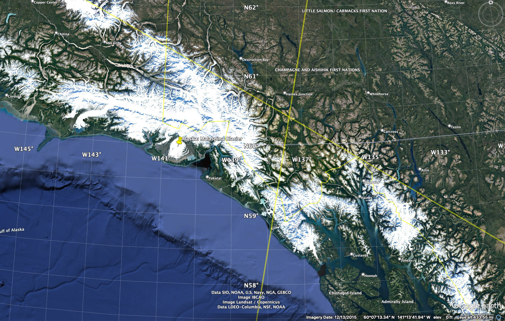

Reviewing cf-apps7865's Youtube Video, [The Equator 12,500 Years Ago?](https://youtu.be/DpNI2FtCgtc),
released May 24, 2014, with 626,561 views as of November 23, 2022.

***Summary***

Chuck of Youtube channel [__cf-apps7865__](https://www.youtube.com/@cfapps7865) entertains a set of ideas, based on his investigations in Google Earth:

  * The lines from the Nazca plain in Peru can be extended around the world.  The point where the lines meet up on the opposite side of the Earth (the antipode), is the ancient site of Angkor Wat in Cambodia.  
  * One of these extended lines passes through the sites of Ollantaytambo, the Great Pyramid at Giza, Angkor Wat, and Easter Island.
  * If this line is considered as an alternate equator, a perpendicular longitudinal line can be drawn from Nazca, which passes through Alaska.  If a similar line is drawn from Giza, it intersects the previous line in SE Alaska, meaning that this could be thought of as an alternate North Pole.  
  * If the triangle formed by Nazca, Giza, and the alternate north pole is measured, the base measures 7677 miles, and the sides measure 6215 miles, producing a triangle with two angles of 51.5 degrees, just like the Great Pyramid itself.

A story of cataclysm is implied by these points, based on source material _Fingerprints of the Gods_ and _Heaven's Mirror_, by Graham Hancock, and _Path of the Pole_, by Charles Hapgood: Prior to the Younger Dryas impact event that ended the last ice age, the Earth had a different pole, and therefore a different equator.  The cataclysmic comet strike  changed the polar orientation of the Earth.  A hypothetical lost civilization which predated this event had mapped the Earth and placed several key sites around the previous equator for geodetic purposes, which we now maintain as ancient sacred sites.

Chuck has illustrated this well enough for a presentation in a simple Youtube video, using Google Earth Pro (GEP).  I wanted to reproduce these line diagrams to learn the technicalities of GEP, and to verify these claims for myself, in a slightly more precise way than Chuck's very casual approach, and to record my methods and findings here.

***Methodology***

I wanted to reproduce this using GEP, the same app Chuck used. I have no prior experience with Geographic Information System (GIS) software, or any formal knowlege of [geodesy](https://oceanservice.noaa.gov/facts/geodesy.html).  Google Earth is an amazing resource that opens these fields up to everyone, and I want to learn to use it in a deeper way.  As a technical challenge, I wanted to be able to draw a circle around the globe as if it were an alternate equator.  I had previously failed to do this by simply clicking around on Google Maps or Google Earth on the web.  It's not a feature that's built into those apps.  So a big part of the appeal of Chuck's video is from wondering, "Hey, how did he actually _do that_?"  Using GEP, it turns out it's not an easy feat to accomplish just by clicking around, either, as far as I can tell.  I had to dig into Keyhole Markup Language (KML), a specialized XML, which can be loaded into GEP for drawing lines and other more complicated shapes.

I read the [official documentation ](https://developers.google.com/kml/documentation) and some Stack Exchange [posts](https://gis.stackexchange.com/a/133119) for guidance.  Once I had figured out how to write the markup for a simple line, there was the challenge of making a line between any 2 given points extend in a complete 360 degree circle around the Earth.  It's a difficult task, because GEP will, given any two points, draw the shortest line between them. There is no way to make it draw the negative of that line, going the long way around the Earth to join the two points.

I don't know how Chuck actually did it, but this was my method (see step 5 for the mathematical solution):

1. Save a point of interest using the pinpoint tool in GEP under My Places, and use the right-click _copy_ action
to grab the auto-generated XML for that single point to the clipboard.

2. Paste the clipboard text into a text editor (VS Code) to read and edit the XML.  All that is
important here is the numerical longitude/lattitude coordinates for the site.
For example, this is the XML element with the coordinates for the apex (center)
of the Great Pyramid of Giza: `<coordinates>104.87359025601792,14.69586512288908,0</coordinates>`.  In the node, the actual coordinate value is `104.87359025601792,14.69586512288908,0` which encodes a longitude, a latitude, and an altitude as comma-separated values. I will make use of this in later steps.

3. Write a new .kml file which will encode a simple version the line I want to draw. This is a basic template which can take a list of two or more coordinates, which are nodes along a segmented line, like a connect-the-dots puzzle (see example in kml/lines/giza_angkor_template.kml). I draw a line between two points of interest:

```
<coordinates>
  31.13421985356293,29.97918784549606,0    <!-- Giza -->
  103.8668450435321,13.41240346106511,0    <!-- Angkor -->
</coordinates>
```
Each CSV coordinate value is separated by whitespace.  I like to use a newline
which allows for comment text at the ends of the lines.

4. I load this into GEP as a temporary item (File > Open). I then drop a pin on a midway point along the newly visible line, and grab the coordinates for the midway point as in setp 2.

5. Delete the temporary item loaded in step 4, then make a new KML file for the full-circle line. My circle solution uses 5 line segments:
* The first point of interest
* A point somewhere along a line drawn between the first and second points of interest.  The actual distance along the line is irrelevant.  I call this a 'midway' point, but it does not have to be exactly equidistant between the endpoints.
* The second point of interest
* The antipode of the midway point.
* The first point of interest, again.

So for the line between Giza and Angkor, the markup looks like this:

```
<coordinates>
  31.13421985356293,29.97918784549606,0    <!-- Giza -->
  67.99588682419022,26.73842563268983,0    <!-- Midway point -->
  103.8668450435321,13.41240346106511,0    <!-- Angkor -->
  -112.00411317580978,-26.73842563268983,0 <!-- Midway antipode -->
  31.13421985356293,29.97918784549606,0    <!-- Giza -->
</coordinates>
```

To determine the antipode of a given coordinate:
* The first part is longitude.  If it is negative (i.e., west of the Prime Meridian), it will be a negative value.  Add 180 (180 degrees is half of 360 degrees, a full circle).  If the longitude is positive (i.e., east of the Prime Meridian), it will be a positive value.  Subtract 180.
* The second part is latitude.  Multiply by -1 to reverse the sign.

So, for example, this is the original coordinate for a point on the Nazca plain: `-75.12640974398208,-14.69586512288908,0`. This is it's antipode: `104.87359025601792,14.69586512288908,0`

Using 5 segments like this will create the seamless illusion of a single line forming a ring around the Earth, overlaying the two points of interest, and it is acceptably accurate.  The new KML file can be opened into GEP as a new item that sits alongside the separate items previously created for the two points of interest.

Then there is the question of how to draw two more lines at perpendicular angles to this line, at the point of interest, to traingulate an alternate pole corresponding to the alternate equator.  To do this:

1. With the equator line loaded and visible, use the Ruler tool, deselect the 'Mouse Navigation' checkbox, and trace a temporary ruler line over the KML line.  The Ruler window will show a _Heading_ value, in degrees.  Make a note of this.  For example, tracing a ruler line from the apex of the great pyramid, to the left a short distance, returns a value of 266 degrees.

2. The perpendicular heading will be 90 degrees away.  Trace a ruler line upwards from the apex point of the pyramid, approximating a 90 degree angle, and adjust until the header value of the new line is 356 degrees.

3. Drop a temporary pin along this newly traced line, and a second temporary pin at another point along this line.  Note the coordinate values for these points.

4. Using the starting point and the new temporary points from step 3, make a new KML file for the perpendicular as described above.

5. Load the perpendicular KML file into GEP alongside the first one and verify by sight.

***Findings***

Sadly, I don't think Chuck's claims bear close scrutiny.  As you zoom out, a site which does not lie along a line will apparently approach the line.  The degree of precision is determined by the to amount to which you zoom out.  Chuck's views are always very zoomed out, on the order of 10,000 miles, viewed from a vantage point showing the whole globe in space.  So there's a lot of glossing over details in order to pursue an appealing, intuitive idea.  I found that the alignments only work given a 110 mile margin of error.

His initial idea of extending the Nazca lines is fraught, because a close look at the Nazca plain will reveal that there are hundreds of lines, that criss-cross each other and create a very jumbled picture.  I was able to screenshot a previous video to catch a frame which showed a relative close-up of Nazca with the dozen or so particular lines he selected for extension, but trying to identify these features on my view in GEP was impossible from lack of resolution on the image Chuck shared in the video.  Trying to find the one Nazca line out of hundreds which happens to extend over the Great Pyramid would be an exercise in futility.  Chuck should have shared a more detailed view of Nazca which explained exactly which lines he chose to follow, and why.  I did play around with a few of the major lines, and I'll describe my own findings below.  They do not confirm Chuck's claims in this video, but there were some otherwise interesting details.

The Antipodal point of the Nazca plain, at which multiple extended lines would cross, does not lie over Angkor Wat.  It is in the same general area, and is a close enough fit when you've zoomed out to a vantage point thousands of miles away, but when viewed with precision, is actually 111 miles away from Angkor Wat.  Choosing to extend longitudinal lines radiating from Nazca around the globe would imply that Nazca would be a polar point on the Earth, but Chuck never indicates that he understands this implication, or why he thinks that would be important.  He is apparently just working on an intuitive hunch that the lines point to sites on the other side of the globe.

Rather than searching for a needle in a haystack by extending every Nazca line, I was able to proceed by assuming that the Great Pyramid of Giza and the pyramid-like Angkor Wat sites were the most important points along the proposed alternate equator line.  Graham Hancock, Chuck's inspiration, had argued for a harmonious geodetic alignment between these sites in his book _Heaven's Mirror_.  As the apex points of these structures are easily found and pinpointed using GEP, I based my new equator line projection on these points, and would then be able to see how close _this_ resulting line is to Nazca.  Sadly, it is not close.  The new equator does pass through Peru, but is 110 miles away from Nazca.  The Easter Island alignment is actually slightly closer, at only 67 miles off.

Zooming in to the Great Pyramid, as Chuck does not do in his video, we see the fatal flaw in this argument.  The new equator, and the new polar longitude do not match the orientation of the structure. It is not square to the cardinal alignments of the faces of the pyramid.  [Mario Buildreps](https://www.mariobuildreps.com/) would not be pleased.  Zooming in on Angkor Wat, the discrepancy is even greater.

I felt the Giza-Angkor projection I had was a reliable basis for continued study, after discarding the Nazca aligment.  When I projected perpendicular lines from Giza and Angkor towards a hypothetical alternate North Pole, the two lines did converge in a spot in SE Alaska, as was shown in the video, albeit at low resolution, and without any explanation or specific details.  The crossing point in Alaska on my line just so happens to lie at the location of Malaspina Glacier.  This is an astonishing wonder-of-the-world major land feature.  Just looking at it from space in GEP is awe-inspiring.  You wonder, "What is this thing?" . It is an appropriately evocative alternate (fictional) North Pole site.

For further corroboration, I repeated the exercise as above, but used Giza and an arbitrary point on the Nazca plain as my endpoints, and discarded a perfect fit over Angkor.  This resulted in a triangle similar to the one found by Chuck. .  Again, the convergence point of the longitudinal lines was somewhere near Malaspina glacier (just over 110 miles away).   Although Chuck did not mention it, I noticed that the Richat Structure in Maruitania was approximately 102 miles from the Giza-Nazca line. .  Again, Angkor Wat is approximately 110 miles from the new equator.

Going back to the Naza lines, I did discover one intriguing alignment, which is not part of the video.  I don't think it makes sense to project these lines all the way around the world, but in at least one case, a Nazca line can be projected onto a perfect alignment with a well-known Inca site on the other side of Peru.  I picked one of the most distinct, square formations close to the official viewing platform at the protected area of Nazca.  The lines of this form are remarkably straight and whoever made them must have been a master surveyor.   By extending this line across Peru, it passes directly over the Coricancha in Cusco, which is the architectural masterpiece at the heart of that mysterious city.   If I extended this line as far as Egypt, it did actually pass between the sites of Elephantine Island and the Kom Ombo Temple, but this was fuzzy (off by about 21 miles and 5 miles, respectively), so I'm just including that as a curiosity.  I think that selecting other Nazca lines to extend and considering other Peruvian sites of interestest, would probably also reveal other relatively strong local alignments.

In conclusion, I was not able to identify the specific Nazca line which Chuck extended to draw his alternate equator, creating a best-fit approximation for alignments over Giza, Angkor, Ollantaytambo, and Easter Island, bringing them all within an approximate 110 mile margin of error.  Perhaps there it could be matched within 108 miles, a number of traditional numerological significance.  Going with the idea that this line would trace a previous equator, and the point in SE Alaska would be a theoretical pole, we would need a better explanation for the cardinal misalignments at Giza and Angkor, and more corroboration from archaeology or historical sources which would indicate a pre-holocene antiquity and a geodetic relation to each other and to Nazca.

***Data***

To view the data for yourself, you will need to have installed the Google Earth Pro [desktop app](https://www.google.com/earth/about/versions/?gl=US&hl=en#download-pro).  To download this repo, scroll to the top of this page, and click the green __Code__ button, then click the __Download ZIP__ link to save a .zip file.  Unzip the file.  Under the folder __kml__, there are two subfolders, __sites__, and __lines__.  Using Google Earth Pro, run File > Open, navigate to either of these folders, and select all contents.  The __sites__ .kml files are pushpins for all relevant ancient cultural sites mentioned in this article.  The __lines__ .kml files are the alignments described in this article.  

Although I only described one extension of a Nazca line in this article, I have included data for 4 such lines which I had worked out.

Enjoy!