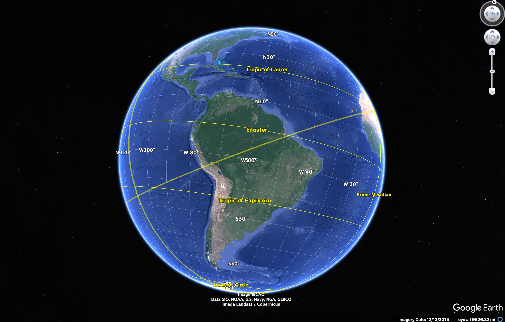
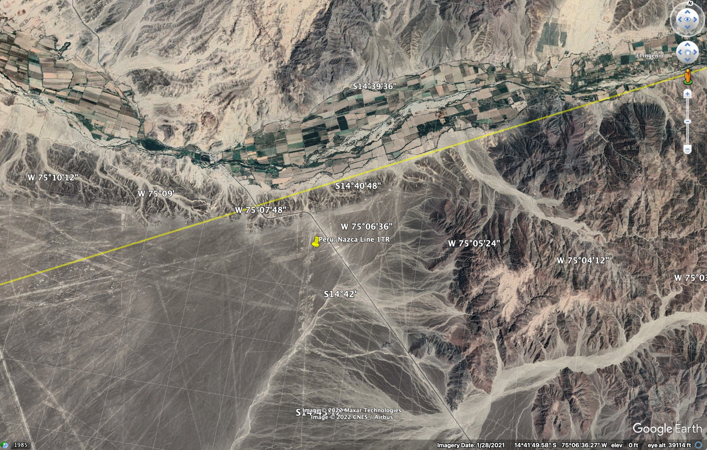

**Reviewing cf-apps7865's Youtube Video, [The Equator 12,500 Years Ago?](https://youtu.be/DpNI2FtCgtc)**

***Summary***

Chuck of Youtube channel [__cf-apps7865__](https://www.youtube.com/@cfapps7865) entertains a set of ideas, based on his investigations in Google Earth.  He says:

  * The lines from the Nazca plain in Peru can be extended around the world.  The point where the lines meet up on the opposite side of the Earth (the antipode), is the ancient site of Angkor Wat in Cambodia.  
  * One of these extended lines passes through the sites of Ollantaytambo, the Great Pyramid at Giza, Angkor Wat, and Easter Island.
  * If this line is considered as an alternate equator, a perpendicular longitudinal line can be drawn from Nazca, which passes through Alaska.  If a similar line is drawn from Giza, it intersects the previous line in SE Alaska, meaning that this could be thought of as an alternate North Pole.  
  * If the triangle formed by Nazca, Giza, and the alternate north pole is measured, the base measures 7677 miles, and the sides measure 6215 miles, producing a triangle with two angles of 51.5 degrees, just like the Great Pyramid itself.

A story of cataclysm is implied by these points, based on source material _Fingerprints of the Gods_ , by Graham Hancock: Prior to the Younger Dryas impact event that ended the last ice age, the Earth had a different pole, and therefore a different equator.  The cataclysmic comet strike changed the polar orientation of the Earth.  A hypothetical lost civilization which predated this event had mapped the Earth and placed several key sites around the previous equator for geodetic purposes, which we now maintain as ancient sacred sites.

Chuck has illustrated this well enough for a presentation in a simple Youtube video, using Google Earth Pro (GEP).  I wanted to reproduce these line diagrams to learn the technicalities of GEP, and to verify these claims for myself, in a slightly more precise way than Chuck's very casual approach, and to record my methods and findings here.

Skip to the next section if you are only interested in alignments, and not KML:

***Methodology***

I wanted to reproduce this using GEP, the same app Chuck used. I have no prior experience with Geographic Information System (GIS) software, or any formal knowlege of [geodesy](https://oceanservice.noaa.gov/facts/geodesy.html).  Google Earth is an amazing resource that opens these fields up to everyone, and I want to learn to use it in a deeper way.  As a technical challenge, I wanted to be able to draw a circle around the globe as if it were an alternate equator.  I had previously failed to do this by simply clicking around on Google Maps or Google Earth on the web.  It's not a feature that's built into those apps.  So a big part of the appeal of Chuck's video is from wondering, "Hey, how did he actually _do that_?"  Using GEP, it turns out it's not an easy feat to accomplish just by clicking around, either, as far as I can tell.  I had to dig into Keyhole Markup Language (KML), a specialized XML, which can be loaded into GEP for drawing lines and other more complicated shapes.

I read the [official documentation ](https://developers.google.com/kml/documentation) and some Stack Exchange [posts](https://gis.stackexchange.com/a/133119) for guidance.  Once I had figured out how to write the markup for a simple line, there was the challenge of making a line between any 2 given points extend in a complete 360 degree circle around the Earth.  It's a difficult task, because GEP will, given any two points, draw the shortest line between them. There is no way to make it draw the negative of that line, going the long way around the Earth to join the two points.

I don't know how Chuck actually did it, but this was my method (see step 4 for the mathematical solution):

__Great Circle__

1. Save a reference point using the pinpoint tool in GEP under My Places, and use the right-click _copy_ action
to grab the auto-generated XML for that single point to the clipboard.

2. Paste the clipboard text into a text editor (VS Code) to read and edit the XML.  All that is
important here is the numerical longitude/lattitude coordinates for the site.
For example, this is the XML element with the coordinates for the apex (center)
of the Great Pyramid of Giza: `<coordinates>104.87359025601792,14.69586512288908,0</coordinates>`.  In the node, the actual coordinate value is `104.87359025601792,14.69586512288908,0` which encodes a longitude, a latitude, and an altitude as comma-separated values. I will make use of this in later steps.

3. Write a new .kml file which will encode a simple version the line to draw. This is a basic template which can take a list of two or more coordinates, which are nodes along a segmented line, like a connect-the-dots puzzle. Draw a line between two reference points by stating both points in the `<coordinates></coordinates>` tag:

```xml
<coordinates>
  31.13421985356293,29.97918784549606,0    <!-- Giza -->
  103.8668450435321,13.41240346106511,0    <!-- Angkor -->
</coordinates>
```

Each CSV coordinate value is separated by whitespace.  I like to use a newline
which allows for comment text at the ends of the lines.

Here is the full template example, from [kml/lines/giza_angkor_template](https://github.com/horizonridgestudio/snakes_kml_1/blob/main/kml/lines/giza_angkor_template.kml) in this repo:

```xml
<?xml version="1.0" encoding="UTF-8"?>
<kml xmlns="http://www.opengis.net/kml/2.2" xmlns:gx="http://www.google.com/kml/ext/2.2" xmlns:kml="http://www.opengis.net/kml/2.2" xmlns:atom="http://www.w3.org/2005/Atom">
<Document>
  <name>Giza-Angkor Template</name>
  <Style id="yellowLine">
    <LineStyle>
      <color>7f00ffff</color>
      <width>4</width>
    </LineStyle>
    <PolyStyle>
      <color>7f00ff00</color>
    </PolyStyle>
  </Style>
  <Placemark>
    <styleUrl>yellowLine</styleUrl>
    <LineString>
      <extrude>1</extrude>
      <tessellate>1</tessellate>
      <coordinates>
        31.13421985356293,29.97918784549606,0    <!-- Giza -->
        103.8668450435321,13.41240346106511,0    <!-- Angkor -->
      </coordinates>
    </LineString>
  </Placemark>
</Document>
</kml>
```

This template can be reused simply by saving to a new filename, and changing `<coordinates></coordinates>` and `<name></name>` tag values.

4. _UPDATED_: Since initial upload of this article, I've realized there is a simpler formula for drawing a great circle than what I had written orignally.  I think my original approach does have some usefulness which I will explore in future articles, but here is the new formula which I think is better for most scenarios:

_The 2-point, 2-antipode cross great circle formula_

Draw line segments connecting these points, in order:
* The first reference point
* The second reference point.
* The antipode of the first reference point.
  * To determine the antipode of a given coordinate:
    * The first value is the longitude.
      * If it is negative (i.e., west of the Prime Meridian), add 180.
      * If it is positive (i.e., east of the Prime Meridian), subtract 180.
    * The second value is the latitude.
      * Multiply by -1 to reverse the sign.
    * For example:
      * This is the a point on the Nazca plain: `-75.12640974398208,-14.69586512288908,0`.
      * This is it's antipode: `104.87359025601792,14.69586512288908,0`.
* The antipode of the second reference point.
* The first reference point, again.

For the Great Pyramid of Giza-Angkor Wat great circle, the `<coordinates></coordinates>` tag looks like this:

```xml
<coordinates>
  31.13421985356293,29.97918784549606,0    <!-- Giza -->
  103.8668450435321,13.41240346106511,0    <!-- Angkor Wat -->
  -148.8657801464371,-29.97918784549606,0  <!-- Giza Antipode -->
  -76.1331549564679,-13.41240346106511,0   <!-- Angkor Wat Antipode -->
  31.13421985356293,29.97918784549606,0    <!-- Giza -->
</coordinates>
```

Using 4 segments like this will give Google Earth the information it needs to draw a great circle around the Earth, overlaying the two points of interest, and it is more accurate than anything drawn freehand.  The new KML file can be opened into GEP as a new item that sits alongside the separate items previously created for the two points of interest.

__Longitude__

Then there is the question of how to draw two more longitudinal circles, at perpendicular angles to the equator circle, at each reference point, to traingulate an alternate pole.  To do this:

1. With the equator line loaded and visible, use the Ruler tool, deselect the 'Mouse Navigation' checkbox, and trace a temporary ruler line over the KML line.  The Ruler window will show a _Heading_ value, in degrees.  Make a note of this.  For example, tracing a ruler line from the apex of the great pyramid, to the left a short distance, returns a value of 266 degrees.

2. The perpendicular heading will be 90 degrees away.  Trace a ruler line upwards from the apex point of the pyramid, approximating a 90 degree angle, and adjust until the header value of the new line is 356 degrees.

3. Drop a temporary pin along this newly traced line.

4. Using the starting point and the new temporary point from step 3, make a new KML file for the perpendicular great circle using the cross method described above.

5. Load the perpendicular KML file into GEP alongside the first one and verify by sight.

***Findings***

Sadly, I don't think Chuck's claims bear close scrutiny.  As you zoom out, a site which does not lie along a line will apparently approach the line.  The degree of precision is determined by the to amount to which you zoom out.  Chuck's views are usually very zoomed out, on the order of 10,000 miles, viewed from a vantage point showing the whole globe in space.  So there's a lot of glossing over details in order to pursue an appealing, intuitive idea.  I found that the alignments only work given a 110-mile margin of error.

His initial idea of extending the Nazca Lines is fraught, because a close look at the Nazca plain will reveal that there are hundreds of lines, that criss-cross each other and create a very jumbled picture.  I was able to screenshot a previous video to catch a frame which showed a relative close-up of Nazca with the dozen or so particular lines he selected for extension, but trying to identify these features on my view in GEP was impossible from lack of resolution on the image Chuck shared in the video.  Trying to find the one Nazca line out of hundreds which happens to extend over the Great Pyramid would be an exercise in futility.  Chuck should have shared a more detailed view of Nazca which explained exactly which Lines he chose to follow, and why.  I did play around with a few of the major Lines, and I'll describe my own findings below.  They do not confirm Chuck's claims in this video, but there were some otherwise interesting details.

The Antipodal point of the Nazca plain, at which multiple extended lines would cross, does not lie over Angkor Wat.  It is in the same general area, and is a close enough fit when you've zoomed out to a vantage point thousands of miles away, but when viewed with precision, is actually 111 miles away from Angkor Wat.  Choosing to extend longitudinal lines radiating from Nazca around the globe would imply that Nazca would be a polar point on the Earth, but Chuck never indicates that he appreciates this implication.  He is apparently just working on an intuitive hunch that the lines point to sites on the other side of the globe.

Rather than searching for a needle in a haystack by extending every Nazca Line, I was able to proceed by assuming that the Great Pyramid of Giza and the pyramid-like Angkor Wat sites were the most important points along the proposed alternate equator.  As the apex points of these structures are easily found and pinpointed using GEP, I based my new great circle on these points, and would then be able to see how close this is to Nazca.  Predictably, it is not close, but is 110 miles away. 

The Easter Island alignment is actually slightly closer, at only 67 miles off.  Out of curiosity, I looked up the antipode of Angkor Wat, which is in the town of Chincha Alta in the Ica region of Peru.  I have included that as a site in the kml data.

Zooming in to the Great Pyramid, as Chuck does not do in his video, we see the skew of an older polar cardinal alignment against the current polar alignment.  The new equator, and the new polar longitude do not match the orientation of the structure. It is not square to the cardinal alignments of the faces of the pyramid.  Zooming in on Angkor Wat, a discrepancy is also evident.

I felt the Giza-Angkor great circle I had was a reliable basis for continued study, after discarding the Nazca aligment.  When I extended perpendicular, longitudinal great circles from Giza and Angkor towards an alternate North Pole, the two circles did converge in a spot in SE Alaska, as was shown in the video, albeit at low resolution, and without any explanation or specific details.  The crossing point in Alaska happens to lie at the location of Malaspina Glacier.  This is an astonishing wonder-of-the-world major land feature.  Just looking at it from space in GEP is awe-inspiring.

For further corroboration, I repeated the exercise as above, but used Giza and _an arbitrary point_ on the Nazca plain as my endpoints, and discarded a perfect fit over Angkor.  This resulted in a triangle similar to the one found by Chuck.   Again, the convergence point of the longitudinal lines was somewhere near Malaspina glacier (just over 110 miles away).   Although Chuck did not mention it, I noticed that the Richat Structure in Maruitania was approximately 102 miles from the Giza-Nazca line. 

The terrain surrounding the Richat structure is a point of corroboration for the geologic significance of this great circle, as there are large-scale fluid erosional patterns running roughly in parrallel with the Giza-Nazca line over vast distances.

Going back to the Naza lines, I did discover one intriguing alignment, which is not part of the video.  I don't think it makes sense to project these lines all the way around the world, but in at least one case, a Nazca line can be extended as a great circle onto a perfect alignment with a well-known Inca site on the other side of Peru.  I picked one of the most distinct, square formations close to the official viewing platform at the protected area of Nazca.  The lines of this form are remarkably straight and whoever made them must have been a master surveyor.   By extending this line across Peru, it passes directly over the Coricancha in Cusco, so perfectly it must be significant.  

This illustrates the utility of great circles, regardless of whether there is a proposed alternate equator.  The great circle allows for discovery of alignments at indeterminate distance.  This is better than drawing freehand, as it would be impossible to know how far to extend the freehand line without knowing of an alignment beforehand.  Once the initial perfect match has been found (the Coricancha in this case), the great circle can be turned off as it has served it's function.  Any further discoveries along the line are optionally corroborative.  If I follow this circle as far as Egypt, it passes between of Elephantine Island and the Kom Ombo Temple, but this seems insignificant.  I think that selecting other Nazca lines to extend, and considering other Peruvian sites of interestest, would likely reveal other relatively strong local alignments.

In conclusion, I was not able to identify the specific Nazca line which Chuck extended to draw his alternate equator, creating a best-fit approximation for alignments over Giza, Angkor, Ollantaytambo, and Easter Island, without accepting a 110-mile margin of error.  Other aspects of the Nazca-Giza-Malaspina triangle hypothesis are intriguing and might bear fruit with further study.

****Update****

After discussion with @MartinOfTheHenges, we've settled on the solution of a Giza-Easter Island great circle to expalain the alignments Chuck was using.  I used the site of Te Pito Kura, the "navel stone" as my reference point on the island.  Interestingly, Easter Island is almost antipodal to Giza;  It is impossible to see both simultaneously in a single view of the globe:



This line does go directly over both Nazca and Ollantaytambo.


Again, Angkor Wat is about 110 miles away, so it seems best to discard that site as a primary reference point in this study.  Marty is also of the opinion that a ~110 mile line width is a reasonable level of precision.  He says, "It's about .25% of the global circumference" .  There are many notable sites that lie within that distance away from this line. 

__Sites and landmarks near the Giza-Easter Island equator line__

* Petra, Jordan: 5 miles
* Machu Picchu, Peru: 14 miles
* Mohenjo Daro, Pakistan: 22 miles
* Pasargadae, Iran: 24 miles
* Cusco, Peru: 25 miles
* Jacó Sá Geoglyph, Acre, Brazil: 48 miles
* mouth of the Amazon, Brazil: 62 miles
* Paracas, Peru: 85 miles
* Cape Verde Islands center point: 88 miles
* Richat Structure, Mauritania: 102 miles
* Angkor Wat, Cambodia: 110 miles

The North Pole based on this line falls somewhat south of the previously determined site, at `-137.4520314531611,57.44252026638491`.


__Landmarks near the Giza-Easter Island pole__

* Juneau, Alaska: 127 miles
* Malaspina Glacier: 206 miles

The relationship to the Nazca Plain is interesting.  This line passes directly over the ridge that marks the border of the Nazca Plain, but does not pass directly over any particular line marked on the plain.



This reinforces my conclusions above that the Nazca site must be considered as dual-purpose.  The plain itself is a significant geodetic site on a global scale, but the lines marked on the plain are more likely of local significance only.

***Links***

Since initial upload of this article, discussions have revealed more related source material covering the Giza-Easter Island great circle.  Jim Allison seems to be the primary source that Gilbertson, Pooyard, and Chuck are drawing from.  I will review each of these works specifically in future articles.  I will also be posting more on KML [my tech blog](https://www.horizonridge.studio/blog).

* Jim Allison, [The Prehistoric Alignment of World Wonders](http://home.hiwaay.net/~jalison/) (2001)
* Patrice Pooyard, [The Revelation of the Pyramids](https://www.imdb.com/title/tt2124189/) (2010)
* Chuck, cf-apps7865, [The Equator 12,500 Years Ago?](https://youtu.be/DpNI2FtCgtc) (2014)
* Jean Seimple [L’Équateur Penché " à 30°- L'Explication Scientifique. EQUINOXE 2/4](https://youtu.be/uhKvs_2_2Hk) (2019)
* Roger Gilbertson, [The Unusual Earth Orbit Circling Above Our Ancient Past, TEDxColoradoSprings](https://www.youtube.com/watch?v=_HytJn6uaRk&start=272) (2020)
* [nazcasolution.com](https://nazcasolution.com/hypothesis/) (2020)
* Jean Seimple [L’Équateur Penché " à 30°- L'Explication Scientifique. EQUINOXE 2/4](https://youtu.be/uhKvs_2_2Hk) (2019)

***Data***

To view the data for yourself, you will need to have installed the Google Earth Pro [desktop app](https://www.google.com/earth/about/versions/?gl=US&hl=en#download-pro).  To download this repo, scroll to the top of this page, and click the green __Code__ button, then click the __Download ZIP__ link to save a .zip file.  Unzip the file.  Under the folder __kml__, there are two subfolders, __sites__, and __lines__.  Using Google Earth Pro, run File > Open, navigate to either of these folders, and select all contents.  The __sites__ .kml files are pushpins for all relevant ancient cultural sites mentioned in this article.  The __lines__ .kml files are the alignments described in this article.  

Although I only described one extension of a Nazca line in this article, I have included data for 4 such lines which I had worked out.

Enjoy!

Brian Davis, https://www.horizonridge.studio/

[This article](https://github.com/horizonridgestudio/snakes_kml_1) ©2022